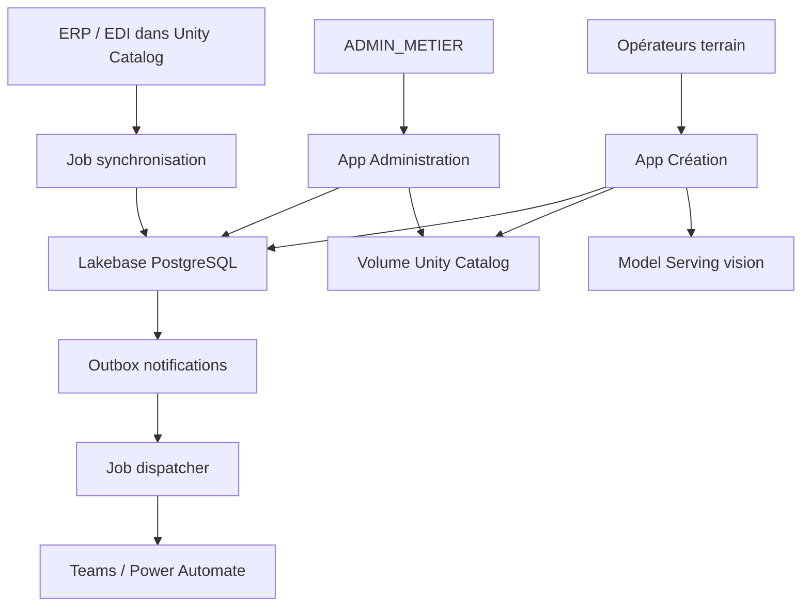
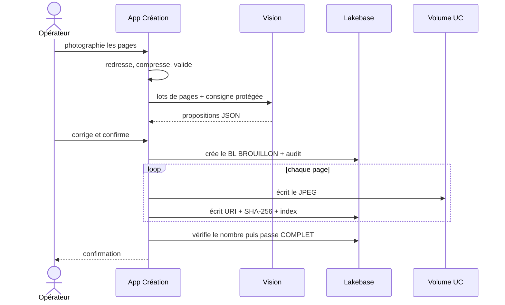

# Architecture et exploitation

## 1. Finalité

BLDEMAT V5 Professional couvre le cycle suivant :

1. un opérateur choisit une opération achat ou vente ;
2. il photographie une ou plusieurs pages ;
3. l'application redresse, compresse et analyse les pages ;
4. l'utilisateur valide les données proposées ;
5. le BL et ses pages sont enregistrés de façon cohérente ;
6. les données ERP/DESADV sont synchronisées ;
7. les administrateurs suivent, corrigent, rapprochent et auditent ;
8. les événements sont diffusés de manière asynchrone.

L'IA reste une assistance. La valeur opposable est celle validée par
l'utilisateur et journalisée.

## 2. Vue d'ensemble

## 3. Composants

| Composant | Responsabilité | État persistant |
|---|---|---|
| App Création | capture, traitement, extraction, validation, finalisation | aucun état serveur local |
| App Administration | pilotage, recherche, CRUD maîtrisé, audit, export | écrans utilisateur en Lakebase |
| `bl_core` | règles métier, RBAC, transactions, stockage et intégrité | aucun |
| Lakebase | métadonnées, référentiels, statuts, audit, outbox | données transactionnelles |
| Volume UC | pages JPEG des BL | binaires documentaires |
| Model Serving | extraction vision optionnelle | aucun dans BLDEMAT |
| Job ERP | snapshot historisé et rapprochement complet | staging UC + métriques Lakebase |
| Job notifications | verrou, envoi, retry, dead-letter | outbox Lakebase |
| Bundle | ressources, paramètres, permissions, planifications | état de déploiement Databricks |

## 4. Flux de création

Une page est idempotente par `(id_bl, index_page)`. En cas d'échec SQL après
une écriture Volume, le fichier est supprimé par compensation. Un BL
`BROUILLON` n'apparaît pas dans les recherches opérationnelles.

## 5. Modèle de données

| Domaine | Tables principales | Règles |
|---|---|---|
| BL | `suivi_bl`, `pieces_jointes_bl` | numéro unique par sens, suppression logique, statut documentaire, version |
| Référentiels | `base_tiers`, `gestionnaires`, `quais`, `adresses`, `pla` | provenance ERP/MANUEL, activité, clés étrangères |
| EDI | `base_desadv`, vue `v_rapprochement_bl_desadv` | dernier état, sens achat/vente, rapprochement insensible à la casse |
| Sécurité | `roles_utilisateurs` | rôles cumulables, expiration optionnelle, dernier admin protégé |
| Audit | `audit_bl`, `audit_evenements` | audit métier dans la transaction de la mutation |
| IA | `qualite_extraction` | valeur proposée/validée, modèle, version de prompt |
| Notifications | `notifications`, `notification_livraisons`, `notification_canaux` | clé d'événement, livraison par canal, retry |
| Exploitation | `job_executions`, `schema_migrations` | résultat, métriques, erreur, checksum |

## 6. Cohérence et concurrence

- Une mutation métier et son audit utilisent la même transaction.
- Les écrans transmettent la `version` lue ; une mise à jour concurrente est
  refusée avec invitation à rafraîchir.
- Le numéro de BL est unique sans tenir compte de la casse, séparément pour
  les sens ACHAT et VENTE.
- Le dispatcher revendique les livraisons avec `FOR UPDATE SKIP LOCKED`.
- Une livraison porte une clé d'idempotence stable ; un retry ne crée pas un
  nouvel événement.
- Les migrations sont ordonnées et leur SHA-256 est enregistré. Une migration
  déjà appliquée mais modifiée bloque l'exécution.

## 7. Sécurité

### Identités

Les apps et les jobs s'exécutent avec des service principals distincts. Les
apps récupèrent l'utilisateur SSO depuis les en-têtes Databricks ; aucune
identité fictive n'est acceptée hors mode local explicitement configuré.

### Autorisation

Deux niveaux se cumulent :

1. permission Databricks `CAN_USE` sur l'app ;
2. rôle applicatif BLDEMAT.

Le RBAC est « fail closed ». Table vide, utilisateur inconnu ou panne de
lecture donnent zéro droit. `BL_BOOTSTRAP_ADMINS` est uniquement prévu pour
l'initialisation et doit être vidé après attribution durable des rôles.

### Données et secrets

- Aucun mot de passe, webhook, email ou endpoint propre à un environnement
  n'est codé en dur.
- Les webhooks sont stockés dans Databricks Secrets.
- Les credentials Lakebase OAuth sont renouvelés avant expiration.
- Les images sont contrôlées par empreinte lors de leur lecture.
- Les brouillons navigateur utilisent `sessionStorage`, isolé par utilisateur,
  et non un stockage persistant partagé.
- Le texte visible dans un document est traité comme donnée non fiable : la
  consigne vision demande explicitement d'ignorer toute instruction embarquée.

## 8. Résilience

| Incident | Comportement |
|---|---|
| Model Serving indisponible | saisie manuelle possible, aucune donnée inventée |
| coupure pendant les pages | reprise idempotente des pages déjà écrites |
| conflit utilisateur | écriture refusée, données existantes conservées |
| webhook indisponible | backoff exponentiel puis dead-letter |
| job ERP interrompu | transaction Lakebase annulée ; dernier snapshot actif conservé |
| snapshot tiers vide | garde-fou : aucune désactivation n'est exécutée |
| RBAC indisponible | toutes les opérations sont bloquées |
| image Volume altérée | lecture refusée par contrôle SHA-256 |

## 9. Observabilité

- Logs structurés JSON pour les jobs.
- `job_executions` : statut, début, fin, métriques et erreur.
- `notification_livraisons` : tentatives, prochaine tentative et dernière
  erreur.
- `audit_bl` : historique complet par BL.
- `audit_evenements` : changements de référentiel.
- `qualite_extraction` : précision par champ et dérive modèle/prompt.
- Le script `tools/preflight.py` vérifie la connexion et les objets attendus.

Alertes recommandées :

- dernier job ERP en échec ou plus ancien que 26 heures ;
- une ligne `DEAD_LETTER` ;
- BL `BROUILLON` de plus de 24 heures ;
- taux de correction IA par champ en hausse ;
- latence Lakebase ou erreurs applicatives au-dessus du SLO.

## 10. Objectifs non fonctionnels recommandés

| Indicateur | Cible initiale |
|---|---|
| disponibilité apps, heures ouvrées | 99,5 % mensuel |
| création hors IA, p95 | < 4 s après confirmation |
| recherche admin, p95 | < 2 s à 50 lignes |
| fraîcheur ERP | < 26 h |
| délai notifications, p95 | < 20 min |
| RPO Lakebase | défini par politique de branche/sauvegarde de l'entreprise |
| RTO | 4 h à valider avec l'exploitation |

Ces cibles doivent être confirmées par des tests de charge avec la volumétrie
réelle et par les capacités du workspace.

## 11. Choix et limites assumées

- Ce produit gère des BL opérationnels ; il ne remplace pas, sans étude
  complémentaire, un système d'archivage électronique à valeur probante.
- Il n'intègre pas de signature électronique ni de politique légale de
  conservation/purge : ces règles dépendent de l'entreprise et du pays.
- Le mapping des vues ERP livré est un adaptateur à valider avec le modèle de
  données réel.
- Les images historiques `BYTEA` restent lisibles après migration. Leur
  déplacement massif vers un Volume doit être planifié et contrôlé séparément.
- Avant la production : revue SSI, tests de restauration, test de charge,
  accessibilité avec utilisateurs terrain et recette métier formelle.

## 12. Références Databricks

- [Ressources de bundle, dont Apps, Postgres et Volumes](https://docs.databricks.com/aws/en/dev-tools/bundles/resources)
- [Ressource Lakebase d'une Databricks App](https://docs.databricks.com/aws/en/dev-tools/databricks-apps/lakebase)
- [Connexion Lakebase et rotation OAuth](https://docs.databricks.com/aws/en/oltp/projects/tutorial-databricks-apps-autoscaling)
- [Volumes Unity Catalog](https://docs.databricks.com/aws/en/volumes/)
